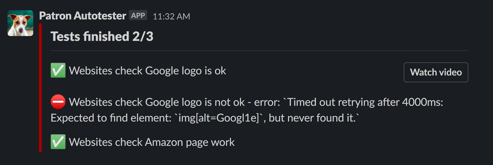

Mocha/Cypress reporter to post tests results directly to Slack

Usable for CI services like [Woodpecker](https://devforth.io/blog/step-by-step-guide-to-modern-secure-ci-setup/)

Read [Guide how to Setup with Woodpecker](https://devforth.io/blog/run-cypress-auto-tests-in-woodpecker-ci/) 


# Example
```
pipeline:
  websitesTest:
    image: cypress/included:10.2.0
    commands:
      - npm install
      - npm install ci-slack-reporter
      - export CI_SLACK_REPORTER_ICON_URL=https://raw.githubusercontent.com/devforth/ci-slack-reporter/master/assets/patron_autotester.png
      - export CI_SLACK_REPORTER_USERNAME="Patron Autotester"
      - export CI_SLACK_REPORTER_VIDEO_URL=https://<bucket name>.s3.eu-central-1.amazonaws.com/output${CI_BUILD_NUMBER}.mp4
      - export CI_SLACK_REPORTER_WEBHOOK=https://hooks.slack.com/services<your slack webhook>
      - cypress run --reporter ci-slack-reporter --spec "cypress/e2e/$${TEST_NAME}.cy.js"

```

Result:


